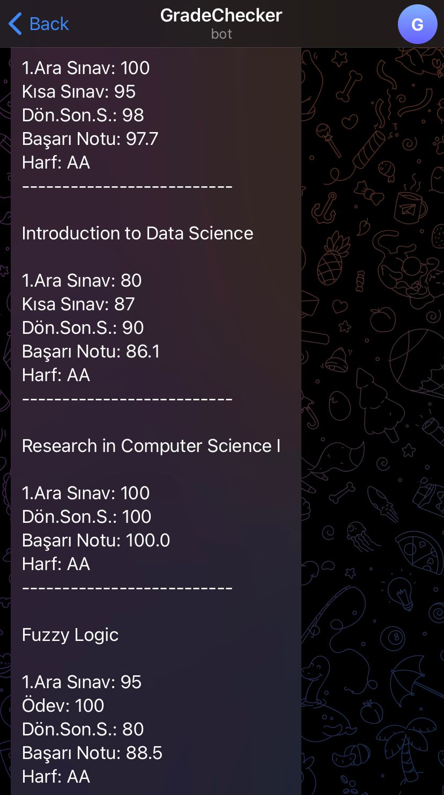

# Grade Notification Bot

It is exhausting to check every time on the university page whether the lecturer has announced the grades or not. Therefore, I decided to create a mini bot to get notified if there are any updated grades via telegram bot. 

<br>

<b>NOTE:</b> It is designed for my university's student information <b>[system](https://obs.eskisehir.edu.tr/#/)</b>.


<p align="center"></p>

## How to Use
First you need to edit <b>info.yaml</b> file according to your information. Your <b>login id & password</b>, telegram <b>bot token & chat id</b> fields are needed to fill. You can learn how to create a bot and get its token <b>[here](https://core.telegram.org/bots/tutorial)</b>. 

<br>
After filling yaml file, the only thing is to run <b>start.py</b> file:

```
python start.py
```